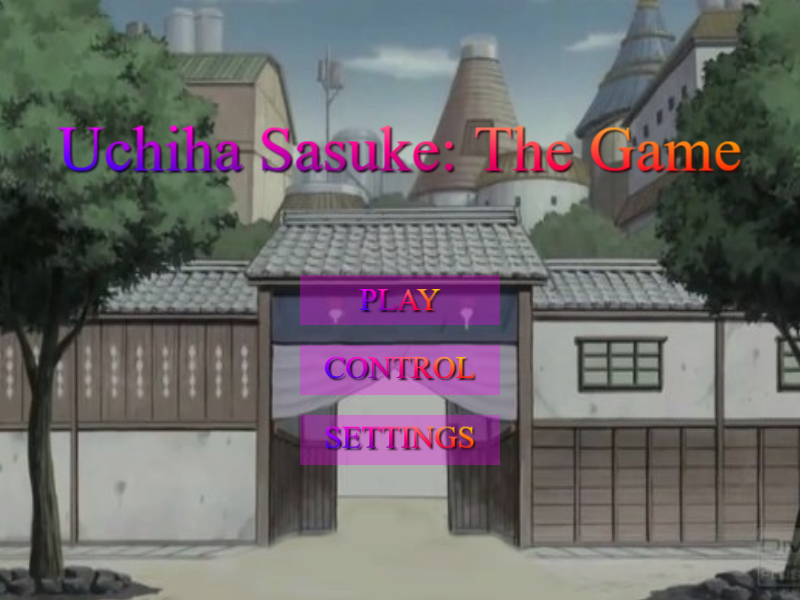
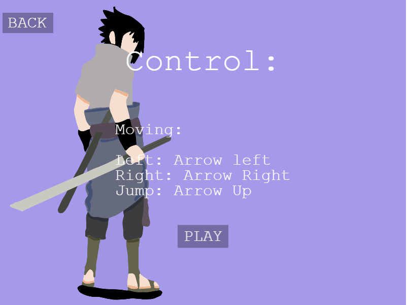
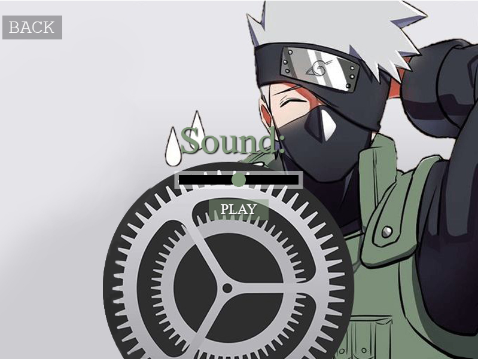
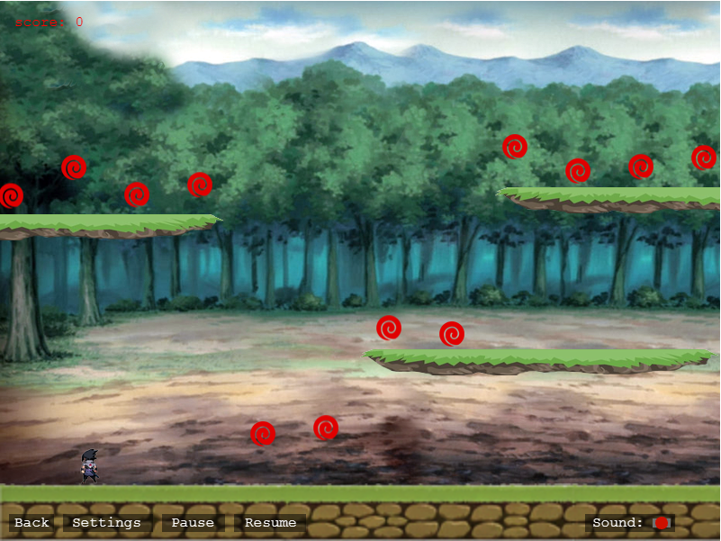
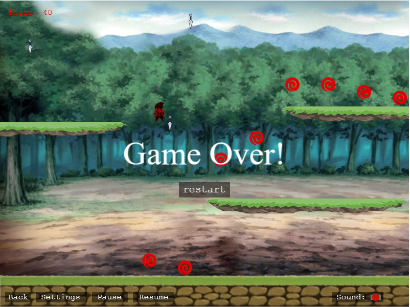

<h1 style="color:red;font-size:40px;">A Szakdolgozat: </h1>           
<h1 style="color:red;font-size:40px;">Engine: Phaser3.6</h1>           
<h1 style="color:red;font-size:40px;">A Játék célja:</h1>           

Egy játékost irányítunk amivel össze kell gyüjteni az érméket és minnél több pontot szerezni (egy érme 1 pont). Akkor van vége a játéknak amikor égből hulló kések megölik a játékosunkat. Minden 12. pont után jön egy újabb kés az égből, amik vissza tudnak pattanni az égből.

Main menu: 

Control: 

Settings: 

The Game : 

Game Over: 

